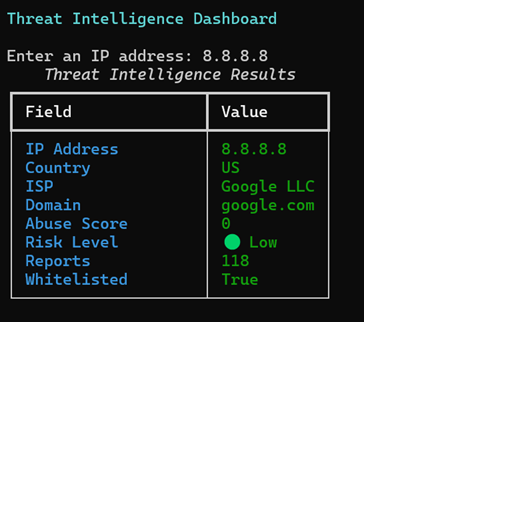

# 🛡️ Threat Intelligence Dashboard

A Python-based Threat Intelligence Dashboard that analyzes IP reputation using the AbuseIPDB API.

---

## 📷 Screenshot




---
## 📌 Features

- 🔍 Analyze public IP addresses
- 🌎 Display ISP, country, and domain information
- 🚨 Calculate threat risk level
- 🎨 Color-coded terminal dashboard
- 🔒 Secure API key management using environment variables
- ⚡ Real-time AbuseIPDB API integration

---

## 🖥️ Technologies Used

- Python
- Requests
- Rich
- python-dotenv
- Git
- GitHub
- AbuseIPDB API

---

## 📷 Screenshot

*(We'll add one later.)*

---

## 🚀 Installation

Clone the repository:

```bash
git clone https://github.com/cryptoglitch/threat-intelligence-dashboard.git
```

Install dependencies:

```bash
pip install -r requirements.txt
```

Create a `.env` file:

```text
ABUSEIPDB_API_KEY=YOUR_API_KEY
```

Run the application:

```bash
python src/main.py
```

---

## 📋 Example Output

```text
IP Address      8.8.8.8
Country         US
ISP             Google LLC
Risk Level      🟢 Low
```

---

## 🔮 Future Improvements

- Domain reputation lookup
- URL reputation lookup
- File hash analysis
- PDF report generation
- SQLite search history
- Flask web dashboard
- Threat analytics dashboard

---

## 👩‍💻 Author

**Paloma Galindo**

Information Technology Management Student

Aspiring Cybersecurity Engineer
